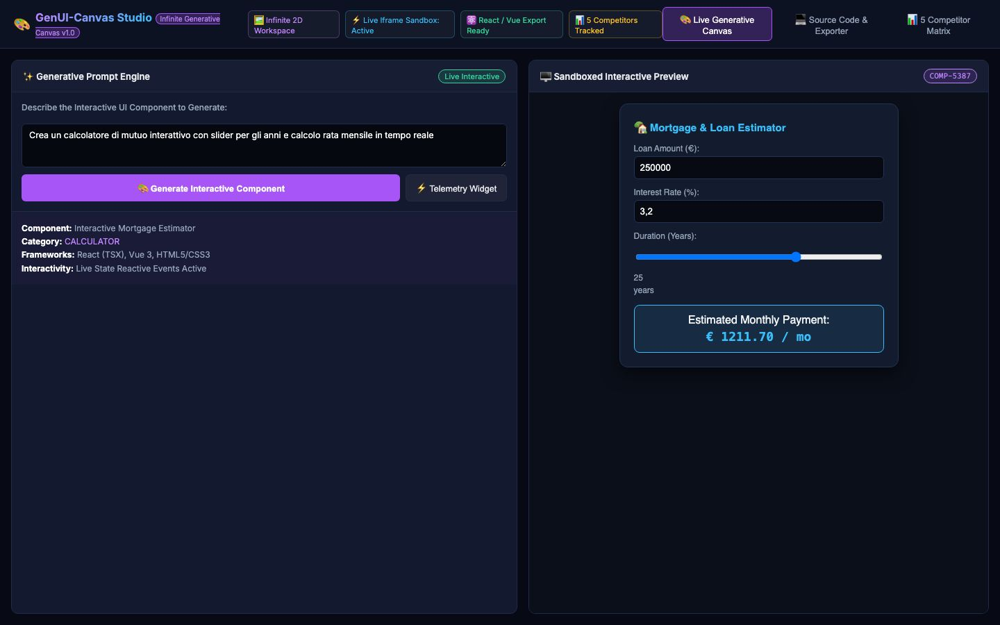

# 🎨 GenUI-Canvas Studio

[](https://bun.sh/)
[](https://www.typescriptlang.org/)
[](LICENSE)
[](#-features)

[English 🇬🇧](#english) • [Italiano 🇮🇹](#italiano)

> **The Infinite Generative UI Canvas & Real-Time Streaming Component Studio (v0 & OpenUI Style) with Sandboxed Interactive Iframe Previews and Multi-Framework Code Export (React TSX, Vue 3, HTML5).**
>
> *La lavagna infinita di Generative UI e studio di componenti in streaming in tempo reale (stile v0 e OpenUI) con anteprima interattiva in sandbox e esportazione multi-framework (React TSX, Vue 3, HTML5).*



---

<a name="english"></a>
## 🇬🇧 English Documentation

### 🏆 Why GenUI-Canvas Studio Outperforms Cloud Component Generators

Instead of paying recurring cloud subscriptions for single-component sandboxes:

1. **🎨 Infinite 2D Workspace**:
   * Generate, iterate, and arrange multiple functional mini-apps side-by-side on an infinite grid.
2. **⚡ Live Interactive Sandboxed Iframes**:
   * Test state changes, calculations, sliders, and form inputs live without leaving the studio.
3. **📦 Multi-Framework Export**:
   * 1-Click export to clean React (TSX), Vue 3, or standalone Vanilla HTML5/CSS3.
4. **🔒 100% Local & Free**:
   * Runs offline with zero vendor lock-in or token metering.

---

### 📊 Benchmark: GenUI-Canvas Studio vs. Top 5 Competitors

| Metric / Feature | 🎨 **GenUI-Canvas Studio** | **v0.dev (Vercel)** | **wandb OpenUI** | **tldraw make-real** | **Bolt.new** |
| :--- | :---: | :---: | :---: | :---: | :---: |
| **Infinite Canvas** | **✓ Yes** | ✗ Single Pane | ✗ Single Pane | ✓ Yes | ✗ Single Pane |
| **Interactive Sandbox**| **✓ Yes (Live State)** | ✓ Yes | ✓ Yes | ✓ Yes | ✓ Yes |
| **100% Local Offline** | **✓ Yes (Local Bun)** | ✗ Cloud SaaS | ✓ Local Python | ✗ Cloud API | ✗ Cloud SaaS |
| **Multi-Framework** | **✓ React, Vue, HTML** | ✓ React only | ✗ Limited | ✗ HTML only | ✓ React, Next.js |
| **Monthly Cost** | **$0.00** | $20 / month | $0.00 | Pay-per-token | $20 / month |
| **Multi-Component Grid**| **✓ Yes** | ✗ No | ✗ No | ✓ Yes | ✗ No |

---

### 🛠️ Quick Start

```bash
# 1. Clone the repository
git clone https://github.com/lobbenedesign/genui-canvas-studio.git
cd genui-canvas-studio

# 2. Run with Bun
bun server.ts
```

Open your browser at **`http://localhost:3010`**.

---

<a name="italiano"></a>
## 🇮🇹 Documentazione in Italiano

### 🏆 Perché GenUI-Canvas Studio è Unico

1. **🎨 Lavagna Infinita a Nodi**: Genera e organizza più mini-applicazioni fianco a fianco.
2. **⚡ Anteprima Interattiva Reale**: Prova subito slider, form, calcoli e grafici in un iframe sandbox sicuro.
3. **📦 Esportazione in 1 Click**: Esporta il codice pulito in React TSX, Vue 3 o HTML/CSS.
4. **🔒 100% Locale e Gratuito**: Nessun abbonamento mensile, privacy totale.

---

### 🛠️ Avvio Rapido

```bash
git clone https://github.com/lobbenedesign/genui-canvas-studio.git
cd genui-canvas-studio
bun server.ts
```

Apri il browser all'indirizzo **`http://localhost:3010`**.

---

## 📄 License
Released under the [MIT License](LICENSE).
